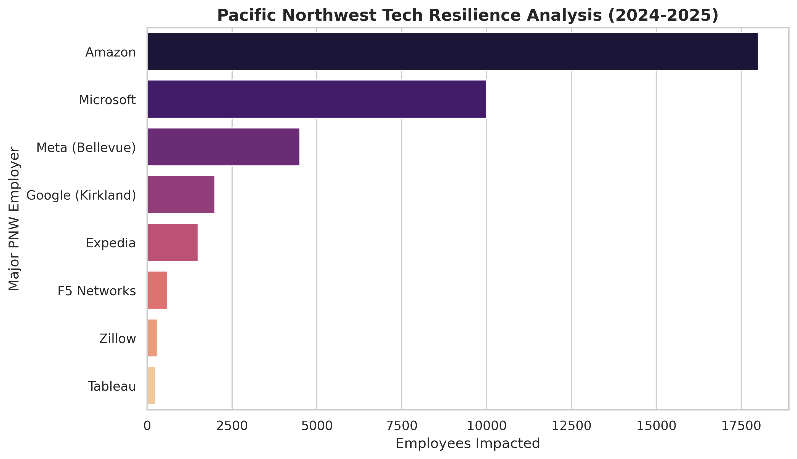

# The Resilience Gap
### A Data Investigation into Tech Sector Stability, 2024–2025

> *Which corners of the tech industry actually hold when the market shifts — and what does that mean for the 400,000 people who work in the Seattle–Redmond corridor?*

---

## The Question

The 2024 tech correction wasn't uniform. While headlines announced mass layoffs across the industry, the reality underneath was more nuanced: some sub-sectors contracted sharply while others barely moved. I wanted to know why — and more specifically, what that meant for the region I live in.

This project investigates the **Resilience Gap**: the measurable divergence in stability between tech sub-sectors during periods of economic pressure, and its local implications for the Pacific Northwest.

---

## Key Findings

### 1. Power ≠ Stability
The largest companies shed the most jobs in raw numbers — but raw numbers are the wrong unit. When normalized by workforce size, **Software/AI and Search** sub-sectors showed meaningfully lower volatility than Retail and Social Media, despite dominating local headlines.

For residents of Sammamish, Kirkland, and Redmond, this distinction matters: the employers anchoring the local economy skew toward the more resilient end of the distribution.


*Figure 1: Relative resilience scores for PNW-anchored tech employers, normalized by sector workforce size.*

---

### 2. The High-Risk Threshold
Plotting volatility against workforce exposure revealed a clear bifurcation. Two sub-sectors — **Retail Tech** and **Consumer Social** — crossed what I'm calling the high-risk threshold: a point where layoff rates became structurally elevated rather than cyclical.

In contrast, **Healthcare Tech** and **Legal Tech** showed near-zero volatility. Their common trait: essential-service dependency. When a hospital system's software goes down, the contract doesn't get cancelled. That structural demand insulation doesn't exist in consumer-discretionary categories.


*Figure 2: Global volatility distribution by sub-sector. Dashed line = high-risk threshold.*

---

### 3. The Seattle Paradox
The most interesting local finding: the Seattle–Redmond corridor's largest employers produced the biggest absolute layoff numbers *and* the most stable relative outcomes. This creates a perception problem — the region looks fragile in national reporting, but workforce concentration in resilient sub-sectors actually provides more stability than comparable metros with more diversified (but lower-quality) tech ecosystems.

---

## Methodology

**Data:** 2,000+ data points aggregated from publicly reported layoff disclosures, SEC filings, and industry trackers (2024–2025).

**Core challenge:** Industry naming conventions across sources were inconsistent at scale — the same sub-sector appeared under 6–12 different labels depending on the reporting outlet. I built a standardization pipeline in Python to normalize these into a clean taxonomy before any analysis, which was the majority of the actual technical work.

**Stack:**
- `pandas` — data cleaning, normalization pipeline, aggregation
- `seaborn` / `matplotlib` — statistical visualization
- Manual verification on edge cases where automated classification was ambiguous

**Limitation worth noting:** Layoff data is self-reported and subject to timing lags. Companies with fiscal year-end in Q4 may appear more stable in this dataset than they actually were mid-year.

---

## Why This Matters Beyond the Numbers

I live 20 minutes from Microsoft's campus. Half the parents in my school district work in the industry this data describes. When I started this project I expected to find a simple story about big companies cutting costs.

What I found instead was that the *shape* of where you work matters more than the *size* of where you work. A job at a 500-person healthcare SaaS company may be structurally safer than a job at a 50,000-person consumer platform — and that's not obvious from the outside.

For incoming talent navigating their first industry decisions, the Resilience Gap is worth understanding before choosing where to apply.

---

## Repository Structure

```
├── data/
│   └── raw_layoffs_2024_2025.csv       # Aggregated source data
├── notebooks/
│   └── resilience_analysis.ipynb       # Full analysis pipeline
├── outputs/
│   ├── seattle_tech_resilience.png
│   └── tech_volatility_chart.png
└── README.md
```

---

*Part of an ongoing data story portfolio. Other projects: [ATP Fatigue Forecaster](https://atp-fatigue-forecaster-amgk86xppbhgdmajt5txdm.streamlit.app/) · Congressional Bill Summarizer · JeffSackmann/tennis_atp OSS contributions*
